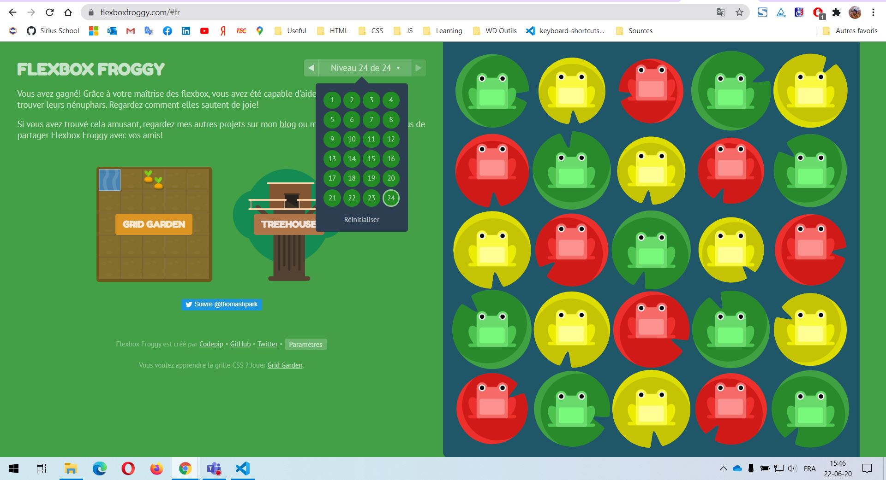
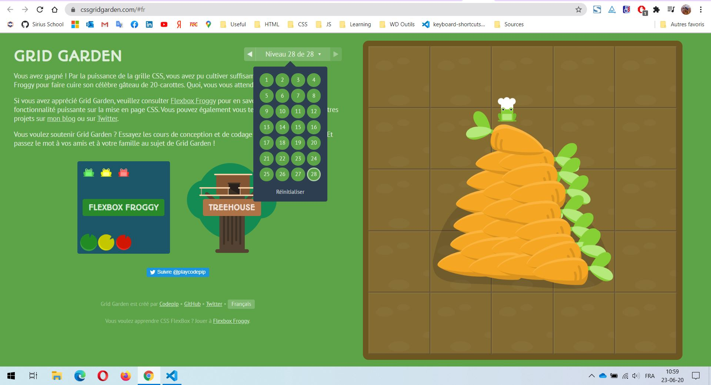

# Exercices HTML / CSS

Voici les exercices de cette semaine concernant la partie HTML / CSS

## Exercices Flexbox

### Flexbox Froggy

Revoici l'exercice qu'on a vu pendant la théorie. Essayez de le finir pour la fin de la semaine

[Flexbox Froggy](https://flexboxfroggy.com/#fr)

Éditez la ligne suivante pour indiquez où vous en êtes arrivé

Je suis arrivé au niveau **24/24**

### Tes propres Flexbox

Dans le dossier "exercices-flexbox-grid" vous trouverez un fichier **flexbox.html**. Ouvrez le dans votre navigateur. Essayez ensuite de reproduire les layouts montré en screenshot en éditant le fichier **flexbox-exN.css**

## Exercices Grid

### Grid Garden

Revoici l'exercice qu'on a vu pendant la théorie. Essayez de le finir pour la fin de la semaine

[CSSGridGarden](https://cssgridgarden.com/#fr)

Éditez la ligne suivante pour indiquez où vous en êtes arrivé

Je suis arrivé au niveau **28/28**

### Tes propres Grids

> :exclamation: Ces exercices ne sont pas encore présent, leurs rédaction est plus laborieuse que je ne pensais... Je vous tiens au courant quand ils seront disponibles. Désolé pour le désagrément, je sais que vous avez hâte de vous y coller.

Dans le dossier "exercices-flexbox-grid" vous trouverez un fichier **grid.html**. Ouvrez le dans votre navigateur. Essayez ensuite de reproduire les layouts montré en screenshot en éditant le fichier **grid-exN.css**.

## CV

Si tu n'avais pas encore finis ton CV ou si tu n'as pas utilisé Flexbox ou Grid, c'est le moment. Repasse un coup sur ton code, améliore le, ajoute du contenu Flexbox et/ou Grid et met le à jour sur ta github page!